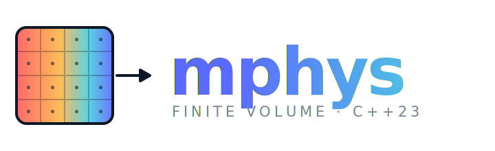

<p align="center">
  
</p>

<p align="center">
  <a href="https://github.com/samaffleck/mphys/actions/workflows/ci.yml"></a>
  <a href="LICENSE"></a>
</p>

A C++23 finite volume library for solving 1D PDEs. Physics models are defined by subclassing `Model` and implementing a residual function; the library handles mesh generation, state management, and time integration via SUNDIALS.

## Features

- Cell-centred FVM on 1D structured meshes — Cartesian, cylindrical, and spherical coordinates
- Transient integration (SUNDIALS IDA) and steady-state solving (SUNDIALS KINSOL)
- FVM operators: `Laplacian`, `Convection`, `Grad`, `Div`, `Ddt`
- COMSOL-inspired GUI with live results plotting (ImGui + ImPlot)
- Cross-platform: macOS, Windows, Linux desktop, and WebAssembly (in the browser)

## Requirements

- CMake ≥ 3.25, Ninja
- A C++23 compiler with `<print>` support:
  - **macOS:** Homebrew LLVM Clang (`brew install llvm`) — the `mac-*` presets point at `/opt/homebrew/opt/llvm/bin/clang++`
  - **Linux:** GCC ≥ 14 or Clang ≥ 18 (the `linux-*` presets use your default compiler from `PATH`)
  - **Windows:** MSVC (VS 2022) or clang-cl
- For the web build: [Emscripten](https://emscripten.org/) (`emcc` / `emcmake` on `PATH`)

All dependencies (SUNDIALS, Google Test, ImGui, ImPlot, **GLFW**) are included as git
submodules — no system packages are required. GLFW is built from source unless a system
install is already present.

```bash
git clone --recurse-submodules <url>
# already cloned without --recurse-submodules?
git submodule update --init --recursive
```

## Build

Presets are provided per platform (`mac`, `linux`, `windows`, `web`), each with a
`-debug` and `-release` variant. Pick the one for your OS:

```bash
cmake --preset mac-debug          # configure (macOS)
cmake --build --preset mac-debug

cmake --preset linux-release      # Linux
cmake --build --preset linux-release

cmake --preset windows-release    # Windows (from a Developer/Ninja shell)
cmake --build --preset windows-release
```

To build the GUI only (faster iteration): append `-gui`, e.g. `cmake --build --preset mac-debug-gui`.

### WebAssembly (browser)

The web build is driven through Emscripten's `emcmake` wrapper, which injects the
toolchain:

```bash
emcmake cmake --preset web-release
cmake --build --preset web-release-gui
```

This produces `build/web-release/gui/mphys_gui.{html,js,wasm,data}`. Serve the folder
over HTTP (the browser cannot load `wasm`/preloaded assets from `file://`):

```bash
cd build/web-release/gui && python3 -m http.server 8000
# then open http://localhost:8000/mphys_gui.html
```

The GUI's native file Open/Save dialogs are compiled out on the web (the browser
sandbox has no filesystem access); the bundled examples remain available.

Targets of interest:

| Target | Path |
|--------|------|
| `mphys_gui` | `build/<preset>/gui/mphys_gui` (`.html` on web) |
| `mphys_tests` | `build/<preset>/tests/mphys_tests` |
| `example_convection_diffusion` | `build/<preset>/examples/...` |
| `example_spherical_diffusion` | `build/<preset>/examples/...` |

## Using mphys in your own project

mphys exposes a single umbrella header and a namespaced CMake target. The
simplest way to depend on it is `FetchContent`:

```cmake
include(FetchContent)
FetchContent_Declare(
  mphys
  GIT_REPOSITORY https://github.com/samaffleck/mphys.git
  GIT_TAG        v1.0.0
)
set(BUILD_GUI OFF)        # skip the desktop app
set(BUILD_TESTS OFF)
set(BUILD_EXAMPLES OFF)
FetchContent_MakeAvailable(mphys)

target_link_libraries(my_app PRIVATE mphys::mphys)
```

You can also vendor the repo and `add_subdirectory(mphys)` directly. Either
way, link against `mphys::mphys` and include the whole public API with one
header:

```cpp
#include <mphys/mphys.hpp>
```

## Defining a physics model

Subclass `Model`, declare fields in the constructor, and implement `Residual`. The same implementation is used for both transient and steady-state solves — `ydot` is empty for steady-state.

```cpp
class ReactorModel : public mphys::Model {
 public:
  ReactorModel(const mphys::Mesh1D& mesh, mphys::StateVector& sv, double D, double u)
      : Model(mesh, sv), D_(D), u_(u) {
    c_ = AddField("c", 0.0);
    SetBcs(c_, {mphys::DirichletBc(1.0), mphys::NeumannBc(0.0)});
  }

  void Residual(double, const std::vector<mphys::Field>& y,
                const std::vector<mphys::Field>& ydot,
                const std::vector<double>&, const std::vector<double>&,
                std::vector<mphys::Field>& rr, std::vector<double>&) override {
    rr[c_] = mphys::fvm::Ddt(ydot[c_])
           + mphys::fvm::Convection(y[c_], u_, mesh_, bcs_[c_])
           - mphys::fvm::Laplacian(y[c_], D_, mesh_, bcs_[c_]);
  }

 private:
  int c_ = 0;
  double D_, u_;
};
```

Running a transient solve:

```cpp
auto mesh = mphys::MakeUniformMesh1D(0.0, 1.0, 100);
mphys::StateVector sv(mesh.n_cells);
ReactorModel model(mesh, sv, 1e-4, 0.01);

mphys::SolverOptions opts;
mphys::SunContext sunctx;
mphys::SimResult result;

mphys::TransientSolver solver(model, opts, sunctx);
solver.Solve(0.0, 50.0, [&](double t, const auto& fields, const auto& alg) {
    result.Record(t, fields, alg);
});
```

Spherical coordinates require only a different mesh factory call — the `Residual` is identical:

```cpp
auto mesh = mphys::MakeUniformMesh1D(1.0, 2.0, 100, mphys::CoordSystem::kSpherical);
```

## Documentation

The full API reference is generated from the header comments with
[Doxygen](https://www.doxygen.nl/):

```bash
doxygen docs/Doxyfile          # writes build/docs/html/index.html
open build/docs/html/index.html
```

It is also published to GitHub Pages on every push to `master` (see
`.github/workflows/docs.yml`).

## Testing

```bash
cmake --build --preset mac-debug --target mphys_tests
ctest --test-dir build/mac-debug -L mphys --output-on-failure

# Analytical convergence checks against closed-form solutions
./build/mac-debug/examples/example_validation_1d_diffusion
```

## Contributing

Contributions are welcome — see [CONTRIBUTING.md](CONTRIBUTING.md) for build,
test, and style guidelines.

## License

Released under the [MIT License](LICENSE). © 2026 Sam Affleck and contributors.
